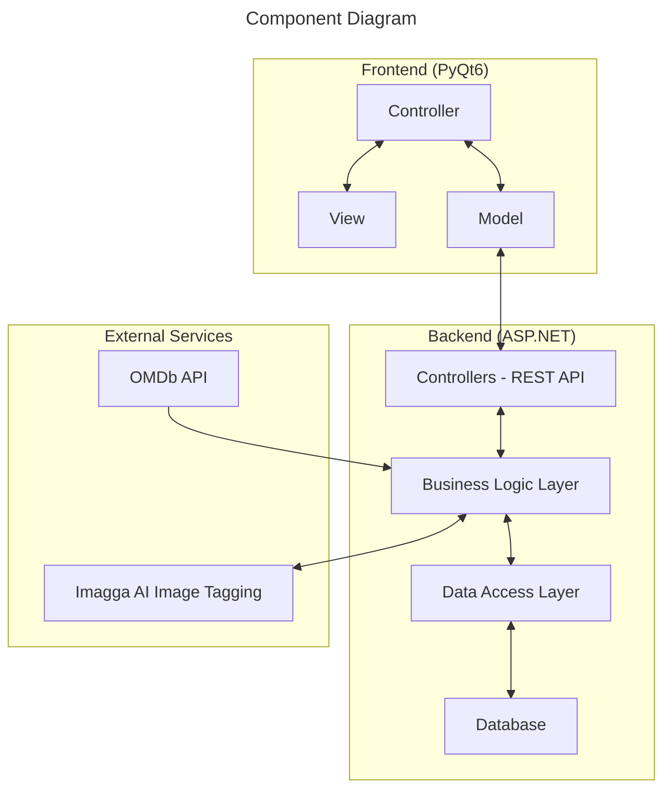

# Media Library Management Application

## Overview

This document outlines the detailed specifications for building a movies/TV series library management application that integrates with the `OMDb API` and `Imagga AI` image tagging service. The application features a `PyQt6` frontend and an `ASP.NET` backend with a `RESTful API`.

### Links To GitHub Repo

1. Frontend - [WindowsSystem-Frontend](https://github.com/dattali18/WindowsSystem-Frontend)
2. Backend - [WindowsSystem-Backend](https://github.com/dattali18/WindowsSystem-Backend)

## Diagrams

### Components



# Frontend - PyQt6

The frontend is structured according to the Model-View-Controller `MVC` architecture. Here is a brief overview of the components:

### Models Example
- `MoviesModel`: Responsible for interacting with the backend API to fetch movies data.

```python
class LibrariesModel:
	def __init__(self, BASE_URL: str = BASE_URL):
		self.BASE_URL = BASE_URL

	def get_libraries(self) -> Optional[list[GetLibraryDto]]:
		"""
		GET - /api/Libraries/
		"""
		url = f"{self.BASE_URL}/Libraries"		
		response = requests.get(url)
		if response.status_code == 200:
			json_str = response.text
			json_obj = json.loads(json_str)
			return [GetLibraryDto(**obj) for obj in json_obj]
		return None
```

### Views Example
- `LibrariesView`: Libraries View of the application many widgets and feature.

```python
class LibrariesView(QMainWindow):
	def __init__(self) -> None:
		super().__init__()
		self.setWindowTitle("Media Library System")
		# open the window at the center of the screen
		self.setGeometry(0, 0, 1200, 800)
```

### Controllers Example
- `LibrariesController`:  the controller for the `LibrariesView`, connect between the `view` and the `model`.

```python
class LibrariesController:
	def __init__(self, view: LibrariesView, model: LibrariesModel):
		self.view = view
		self.model = model
```

### Usage

```python
def libraries_window() -> None:
	app = QApplication(sys.argv)
	
	view = LibrariesView()
	model = LibrariesModel()
	controller = LibrariesController(view=view, model=model)
	controller.view.show()
	
	sys.exit(app.exec())

def main() -> None:
	libraries_window()
	
if __name__ == "__main__":
	main()
```

## Screen Shot (`Mac OS`)

### Libraries Window

### Library Window

### Media Window

### Update Window


# Backend - ASP\.NET

The backend is responsible for handling the business logic and providing a RESTful API for the frontend to interact with. It consists of the following components:

- **Data Entities**: Movie, TvSeries, and Library entities.
- **Controllers**: API endpoints for managing movies, TV series, and libraries.
- **Business Logic Layer**: Handles data processing and interactions with external services.
- **Data Access Layer**: Manages interactions with the database.


## Other Components

- **Database**: The application uses the `DbContext` provided by `ASP.NET` in the `EntityFrameworkCore`, for data storage.

## External Services Integration

- **OMDb API**: Used for searching and retrieving movie/TV series details.
- **Imagga AI Image Tagging Service**: Used for generating tags for movie/TV series posters based on emotions or other criteria.

## API Endpoints

###  Movies
- `GET - /api/Movies/` - returns a list of all movies in the database in `GetMovieDto` format
- `GET - /api/Movies/{id}` - return a movie with id from the database
- `GET - /api/Movies/search/?s={s}&y={y}` - return a list of `MediaDto` from the `OmdbService`
- `GET - /api/Movies/search/{imdbID}` - return a movie from the database with the `imdbID`
- `POST - /api/Movies/?imdbID={imdbID}` - will add a the movie with the `imdbID` into the database (from the `OmdbService`)

### Tv Series
- `GET - /api/TvSeries/` - returns a list of all series in the database in `GetTvSeriesDto` format
- `GET - /api/TvSeries/{id}` - return a series with id from the database
- `GET - /api/TvSeries/search/?s={s}&y={y}` - return a list of `MediaDto` from the `OmdbService`
- `GET - /api/TvSeries/search/{imdbID}` - return a series from the database with the `imdbID`
- `POST - /api/TvSeries/?imdbID={imdbID}` - will add a the series with the `imdbID` into the database (from the `OmdbService`)

### Library
- `GET - /api/Libraries/` - list of all libraries in the database in a `GetLibraryDto` format
- `GET - /api/Libraries/{id}` - a library in the database with id=id in a `GetLibraryDto` format
- `GET - /api/Libraries/{id}/movies` - a list of all movies in the library with id=id in a `MediaDto` format
- `GET - /api/Libraries/{id}/tvseries` - a list of all Tv Series in the library with id=id in a `MediaDto` format
- `GET - /api/Libraries/search/{name}` - a list of all libraries in the database with name starting with name in a `GetLibraryDto` format
- `GET - /api/Libraries/search?name={name}&keywords={keywords}` - a list of all libraries in the database with the name and keywords in a `GetLibraryDto` format
- `POST - /api/Libraries/` - a library object that was created
- `POST - /api/Libraries/{library_id}/movies?imdbID={imdbID}` - the movie object that was added to the library in `MediaDto` format
- `POST - /api/Libraries/{library_id}/tvseries?imdbID={imdbID}` - the tv series object that was added to the library in `MediaDto` format
- `DELETE - /api/Libraries/{library_id}/movies?imdbID={imdbID}` - delete the movie with `imdbID` from the library
- `DELETE - /api/Libraries/{library_id}/tvseries?imdbID={imdbID}` - delete the series with `imdbID` from the library
- `PUT - /api/Libraries/{id}` - will update the library according to the json object (`CreateLibraryDto`) in the requests body
- `DELETE - /api/Libraries/{id}` - will delete the library from the database

## Testing and Quality Assurance

- **Unit Testing**: Guidance and assistance with writing unit tests for the frontend and backend components would be appreciated.
- **Integration Testing**: Guidance on testing the integration between the frontend, backend, and external services (`OMDb API`, `Imagga AI`) would be beneficial.
- **Code Quality**: Suggestions on coding standards, linting rules, and code quality metrics to follow would be helpful.

## Installation

To install the project you'll need to clone both the frontend and the backend repo

```bash
git clone https://github.com/dattali18/WindowsSystem-Frontend.git 
```

```bash
git clone https://github.com/dattali18/WindowsSystem-Backend.git
```

activate the virtual environment of your choice in the frontend and
then install all the needed packages using `pip`

```bash
pip install -r requirements.txt
```

> [!note]
> you'll might need to use a virtual environment in order to run the `pip` commend.

and in the backend install 3 libraries to run the program:

- `Microsoft.EntityFrameworkCore`
- `Microsoft.EntityFrameworkCore.SqlServer`
- `Microsoft.EntityFrameworkCore.Tools`
> [!note]
> this is for `Windows` users, for `MacOs` users you'll need to use `SQLite` instead of `SQLServer` and you'll need to install the following libraries:
- `Microsoft.EntityFrameworkCore.Sqlite`


> [!tip]
> on `MacOs` you can still run the backend using `SQLite` but on `Windows` you'll need to use `SQLServer` to run the backend.
> use `dotnet add package <package_name>` to add the package to the project.
> then run the migration using `dotnet ef migrations add <migration_name>` and then `dotnet ef database update` to update the database.
> then run the project using `dotnet run`


## Deployment

- No Deployment, in order to run the project you'll need to install using the instruction above, and then run the backend using `VisualStudio` and then run the frontend using `python` 

```bash
python main.py
 ```
