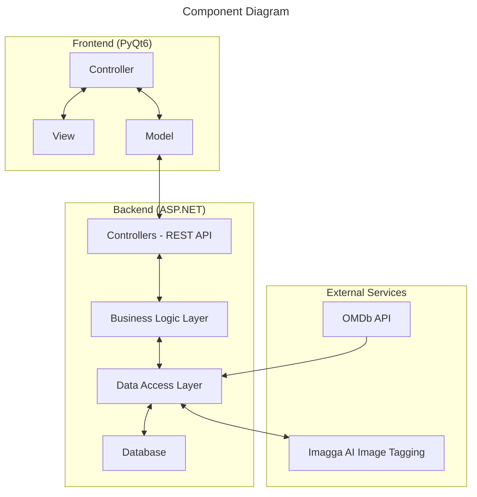

# Media Library Management Application

## Overview

This document outlines the detailed specifications for building a movies/TV series library management application that integrates with the `OMDb API` and `Imagga AI` image tagging service. The application features a `PyQt6` frontend and an `ASP.NET` backend with a `RESTful API`.

### Links To GitHub Repo

1. Frontend - [WindowsSystem-Frontend](https://github.com/dattali18/WindowsSystem-Frontend)
2. Backend - [WindowsSystem-Backend](https://github.com/dattali18/WindowsSystem-Backend)

## Diagrams

### Components



## Frontend - PyQt6

The frontend is structured according to the Model-View-Controller `MVC` architecture. Here is a brief overview of the components:

### Models Example
- `MoviesModel`: Responsible for interacting with the backend API to fetch movies data.

```python
class MoviesModel:
    def __init__(self, PORT: int = PORT):
        self.PORT = PORT

    def get_movies(self) -> list[Movie]:
        ...
```

### Views Example
- `MainWindow`: Main window of the application with a menu bar and actions to switch between different views.

```python
class MainWindow(QMainWindow):
    def __init__(self):
        super().__init__()
        ...

    def change_widget(self, current_frame):
       ...
```

### Controllers Example

- `Controllers`: TODO add some text

```python
class MoviesController:
    ...
```

## Backend - ASP\.NET

The backend is responsible for handling the business logic and providing a RESTful API for the frontend to interact with. It consists of the following components:

- **Data Entities**: Movie, TvSeries, and Library entities.
- **Controllers**: API endpoints for managing movies, TV series, and libraries.
- **Business Logic Layer**: Handles data processing and interactions with external services.
- **Data Access Layer**: Manages interactions with the database.


## Other Components

- **Database**: The application uses the `DbContext` provided by `ASP.NET` in the `EntityFrameworkCore`, for data storage.

## External Services Integration

- **OMDb API**: Used for searching and retrieving movie/TV series details.
- **Imagga AI Image Tagging Service**: Used for generating tags for movie/TV series posters based on emotions or other criteria.

## Testing and Quality Assurance

- **Unit Testing**: Guidance and assistance with writing unit tests for the frontend and backend components would be appreciated.
- **Integration Testing**: Guidance on testing the integration between the frontend, backend, and external services (`OMDb API`, `Imagga AI`) would be beneficial.
- **Code Quality**: Suggestions on coding standards, linting rules, and code quality metrics to follow would be helpful.

## Installation

To install the project you'll need to clone both the frontend and the backend repo

```bash
git clone https://github.com/dattali18/WindowsSystem-Frontend.git <path_to_folder>
```

```bash
git clone https://github.com/dattali18/WindowsSystem-Backend.git <path_to_folder>
```

then in the backend install all the needed packages using `pip`

```bash
pip install -r requirements.txt
```

> Note: you'll might need to use a virtual environment in order to run the `pip` commend.

and in the backend install 3 libraries to run the program:

* `Microsoft.EntityFrameworkCore`
* `Microsoft.EntityFrameworkCore.SqlServer`
* `Microsoft.EntityFrameworkCore.Tools`


## Deployment

- No Deployment, in order to run the project you'll need to install using the instruction above, and then run the backend using `VisualStudio` and then run the frontend using `python` 
```bash
python main.py
 ```
